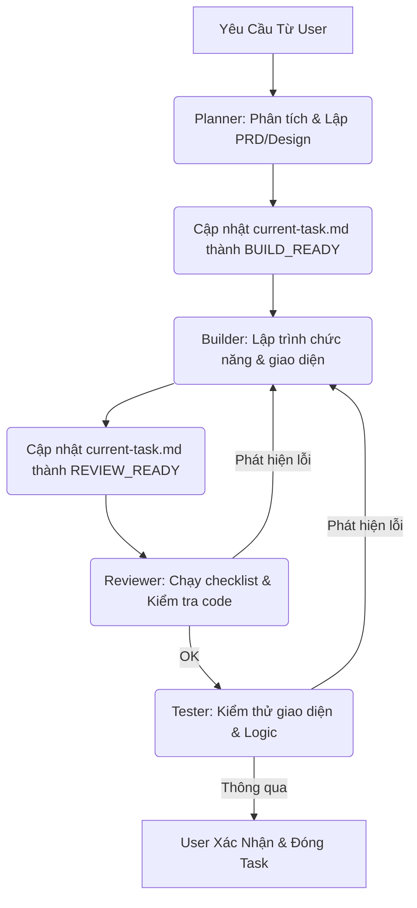

# AGENTS.md — Quy Trình Hợp Tác Giữa Các AI Agent (BMAD Workflow)

> File này định nghĩa vai trò, quy chuẩn và luồng làm việc phối hợp của hệ thống **4 AI Agent (Planner, Builder, Reviewer, Tester)** trong dự án **English & Math Fun**.

---

## 📌 Tổng Quan Dự Án & Tech Stack

- **Dự án**: English & Math Fun (Học Tiếng Anh Lớp 2 Global Success & Toán Lớp 2 NXB Giáo dục).
- **Mục tiêu**: Phần mềm hoàn chỉnh, đa người dùng, lưu trữ đám mây, trực quan hóa cách giải toán tự học cho trẻ nhỏ.
- **Công nghệ**:
  - **Frontend**: HTML5, Vanilla CSS (Premium Custom Styles), Javascript (ES6+), Bootstrap 5.
  - **Database & Auth**: Firebase Realtime Database & Firebase Auth (đồng bộ tiến độ thời gian thực).
  - **Visualization**: SVG đồ họa vector động (vẽ đồng hồ ảo, thước kẻ đo cm).
  - **Libraries**: Chart.js (vẽ đồ thị học tập 7 ngày).

---

## 🤖 Hệ Thống 4 AI Agent & Vai Trò Phối Hợp

Để phát triển sản phẩm một cách chuyên nghiệp và không gây xung đột code, quy trình BMAD chia làm 4 vai trò tác nhân chính:

### 1. Planner Agent (Antigravity)
- **Nhiệm vụ**: Phân tích nghiệp vụ từ yêu cầu của người dùng, lập kế hoạch chi tiết, cập nhật thiết kế hệ thống.
- **Thư mục quản lý**:
  - `bmad/pm/prd.md` — Mô tả yêu cầu sản phẩm và lộ trình tính năng.
  - `bmad/architect/design.md` — Thiết kế database Firebase, thuật toán sinh câu hỏi và Spaced Repetition.
- **Đầu ra**: Tài liệu phân tích nghiệp vụ + cập nhật kế hoạch công việc `current-task.md` chuyển trạng thái sang `BUILD_READY`.

### 2. Builder Agent (Developer - Codex / Cursor)
- **Nhiệm vụ**: Đọc kế hoạch từ Planner và thực hiện viết mã nguồn, lập trình logic, xây dựng giao diện.
- **Thư mục quản lý**:
  - `bmad/developer/guide.md` — Quy chuẩn mã nguồn và cấu trúc thư mục.
- **Quy trình làm việc**:
  1. Đọc `bmad/pm/prd.md` và `bmad/architect/design.md` để hiểu yêu cầu & thiết kế.
  2. Lập trình chính xác các file được chỉ định trong danh sách công việc.
  3. Cập nhật `current-task.md` sang trạng thái `REVIEW_READY`.

### 3. Reviewer Agent (AI Code Reviewer)
- **Nhiệm vụ**: Đọc lại code do Builder viết, so sánh với thiết kế kiến trúc ban đầu và kiểm tra tiêu chuẩn chất lượng.
- **Quy tắc kiểm tra**:
  - Code sạch, không có placeholder hoặc console.log dư thừa.
  - Đảm bảo tính năng Multi-user đồng bộ chính xác trên Firebase qua `ProgressManager`.
  - Đảm bảo giữ nguyên các bình luận, tài liệu quan trọng trong file cũ.
- **Đầu ra**: Báo cáo đánh giá `APPROVED` (chấp thuận) hoặc `NEEDS_FIX` (yêu cầu sửa đổi).

### 4. Tester Agent (AI Tester)
- **Nhiệm vụ**: Xây dựng kịch bản kiểm thử, kiểm tra biên, phát hiện lỗi giao diện (UI) và logic (Bug).
- **Thư mục quản lý**:
  - `bmad/tester/testplan.md` — Danh sách các testcase cần thực hiện.
- **Đầu ra**: Báo cáo kết quả kiểm thử, chỉ ra các lỗi cần Builder sửa trước khi hoàn thiện task.

---

## 🚫 Quy Tắc Cứng (Hard Rules)

```
❌ KHÔNG sửa cấu trúc DB trực tiếp: Mọi thay đổi dữ liệu/cấu trúc bảng phải viết mã lệnh SQL DDL/DML đưa người dùng chạy thủ công.
❌ KHÔNG lưu trữ file JSON tiến độ cục bộ: Firebase Realtime Database là nguồn chân lý duy nhất cho toàn bộ tiến trình học tập.
❌ KHÔNG tự ý import thư viện ngoài: Chỉ sử dụng các CDN đã được đồng ý trong thiết kế (Bootstrap, Firebase, Chart.js).
✅ BẮT BUỘC kiểm tra trạng thái login của học sinh trước khi cho phép vào các trang học/làm bài tập.
```

---

## 🔄 Luồng Làm Việc Chi Tiết (Workflow)



---

*Mọi AI Agent khi nhận nhiệm vụ trên thư mục nguồn này đều phải tuân thủ nghiêm ngặt quy trình BMAD trên.*
